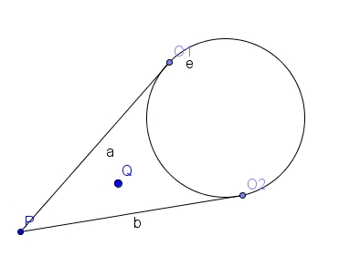

# 2009 Nordic Collegiate Programming Contest

<table>
<thead>
<th width='40px' align='center'>Id</th>
<th width='500px' align='left'>Problem</th>
<th width='130px' align='left'>Link</th>
<th width='80px' align='left'>Code</th>
</thead>
<tbody>
<tr><td>A</td>   <td>Soda Surpler</td>   <td></td>   <td></td>   </tr>
<tr><td>B</td>   <td>Money Matters</td>   <td></td>   <td></td>   </tr>
<tr><td>C</td>   <td>Allergy Test</td>   <td></td>   <td></td>   </tr>
<tr><td>D</td>   <td>Rain Fall</td>   <td></td>   <td></td>   </tr>
<tr><td>E</td>   <td>Speedy Escape</td>   <td><a href='http://acm.hdu.edu.cn/showproblem.php?pid=3143'>HDU 3143</a></td>   <td><a href='hdu3143.cpp'>C++</a></td>   </tr>
<tr><td>F</td>   <td>Gokigen Naname</td>   <td></td>   <td></td>   </tr>
<tr><td>G</td>   <td>Flight Planning</td>   <td></td>   <td></td>   </tr>
<tr><td>H</td>   <td>Beacons</td>   <td><a href='http://acm.hdu.edu.cn/showproblem.php?pid=3146'>HDU 3146</a></td>   <td><a href='hdu3146.cpp'>C++</a></td>   </tr>
<tr><td>I</td>   <td>Playfair Cipher</td>   <td></td>   <td></td>   </tr>
<tr><td>J</td>   <td>Code Permutations</td>   <td></td>   <td></td>   </tr>
</tbody>
</table>

## Problem E. Speedy Escape

##### Solution

首先，预处理出Police以最大速度160km/h的速度到达所有节点所需要的最短时间。由于答案满足单调性，因此可以使用二分求解。二分一个速度，使用类似最短路算法的扩展思想求出Brother到达每个节点的最短时间，注意，如果Brother到达该节点的最短时间慢过Police的最短时间，那么这个节点就不能扩展。

## Problem H. Beacons

##### Summary
平面上有N个点和M个圆(N,M\<=1000)。问这些点组成多少个连通块。两个点称为连通，当且仅当两点可视，也就是连线不经过任何圆。数 据保证所有的点不会在圆里面，且任意两点连线不会与任何圆相切。

##### Solution
朴素的做法是两两枚举点，再判断这两个点的连线是否经过圆。这样做复杂度达到1000^3，必定会超时。

比较好的做法是枚举一个点，然后预处理出哪些点与这个点是连通可视的，然后用并查集统计有多少个连通块。如图：对于每个点P，其与某圆O的切线为PO1、PO2（O1,O2为切点）。那么，如果一个点Q若落在∠O1PO2的范围内，那么如果|PQ|\<|PO1|，那么Q点必定可视。也就是说：在一定角度范围内，只要点Q到P的距离小于最小的POi，那么该点必定可视，否则不可视。这是题目的规定所得到的规律，因为任何一个点不会和圆重合。

那么可以得到一个极角排序的算法。枚举一个点，统计与所有圆相切的切线的角度，以及切线段的距离，称为圆事件。圆事件有两种，一种是进入一 个圆的角度范围，一种是退出一个圆的角度范围。如果进入则把该切线距离保存进一个平衡树之中，退出则从平衡树中删除该切线距离。还有一种事件称为点事件。 在某些角度范围内，会遇到一些点，要判断这些点Q到P的距离是否小于最小的切线距离。最小的切线距离明显是平衡树的最小节点，容易获得。将所有事件按照角 度排序，扫描一次即可。

注意，某些圆可能会横跨360度。我的做法是将这种圆拆成两部分。一部分位于0度以下，一部分位于0度以上。

除了这种方法，也可以采用树状数组＋离散化切线距离＋按极角排序进行统计。 

PS：杭电的数据非常强悍，时限30秒……