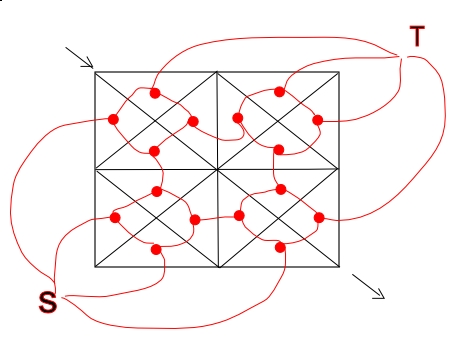

# The 2006 Asia Regional Contest - Beijing

<table>
<thead>
<th width='40px' align='center'>Id</th>
<th width='500px' align='left'>Problem</th>
<th width='130px' align='left'>Link</th>
<th width='80px' align='left'>Code</th>
</thead>
<tbody>
<tr><td>A</td>   <td>Robot</td>   <td></td>   <td></td>   </tr>
<tr><td>B</td>   <td>Animal Run</td>   <td>LA 3661</td>   <td><a href='la3661.cpp'>C++</a></td>   </tr>
<tr><td>C</td>   <td>Another Minimum Spanning Tree</td>   <td>LA 3662</td>   <td><a href='la3662.cpp'>C++</a></td>   </tr>
<tr><td>D</td>   <td>Connect It, If You Can!</td>   <td></td>   <td></td>   </tr>
<tr><td>E</td>   <td>Guess</td>   <td>LA 3664</td>   <td><a href='la3664.cpp'>C++</a></td>   </tr>
<tr><td>F</td>   <td>XAR</td>   <td></td>   <td></td>   </tr>
<tr><td>G</td>   <td>What a Special Graph</td>   <td></td>   <td></td>   </tr>
<tr><td>H</td>   <td>Ruler</td>   <td>LA 3667</td>   <td><a href='la3667.cpp'>C++</a></td>   </tr>
<tr><td>I</td>   <td>A Funny Stone Game</td>   <td></td>   <td></td>   </tr>
</tbody>
</table>

## Problem B. Animal Run

OJ and Id							| Language	| Status        | Run Time / Limit            |
-----------------------				| --------	| ------------- | -------------               |
ACM-ICPC Live Archive 3661			| C++		| Accepted		| 0.746 s / 6.000 s			  |

##### Solution
由于题目的规模巨大，使用普通的网络流算法是无法解决的。因此需要使用其他方法。实际上，由于图是一个平面图，因此 可以将最大流问题转化为一个最短路问题。 一个通用的解决方法是：

如图，建立无向图 G = (V, E)，将每个平面看成一个点，相临两个平面 f1, f2 之间有公共边(u, v)时，在 G 中连边(v1, v2)，权值为(u, v)的权，其中 v1, v2 分别是 f1, f2 在 G 中对应的结点。值得注意的是对于最外边的无界区域，要建立两个结点 s, t 表示源和汇，并分立原图中 s-t 线的两侧，且 s 只与跟 s 在 s-t 线同侧的区域连边，t 也是一样。之后对图 G 求一次从 s 到 t 的最短路即为答案。最后用Heap+Dijkstra最短路算法解决即可。 

为了节省内存，可以不将整个图都建立起来。而是一边求最短路一边建图。 

## Problem C. Another Minimum Spanning Tree

OJ and Id							| Language	| Status        | Run Time / Limit            |
-----------------------				| --------	| ------------- | -------------               |
ACM-ICPC Live Archive 3662			| C++		| Accepted		| 3.409 s / 9.000 s			  |

##### Summary
给出一个有N个点的平面点集(N<=100000)的坐标，求该点集的最小生成树。点与点之间的距离为他们之间的Manhattan距离。

题目给出重要提示：对于一个点O，在45度角度的范围内，最多只有一条连出去的边。 
##### Solution
由于给出的数据规模很大，因此不能够直接求最小生成树。对于题目给出的提示，仔细分析这一性质，我们猜想，这一条边是否一定是这个顶点在这一方向 45度内的最小边？事实上，可以证明这一猜想是正确的。

因此可以在建图时每一个顶点仅连出8条边，这样图中边数至多为点数的4倍，采用Kruskal算法可在时限内出解。

实现时的一些细节问题：

1.得到45度角内距离最近的点，实际上就是这样一个问题：对于当前点O，在y坐标大于等于O的y坐标的点集中，找出一个点，使其x+y最 小，且这这个点必须在45度的范围内。解决这个问题可用线段树，方法是按该点所在的斜线(y=x+w)的w的大小顺序，从小到达插入顶点（如果y-x相 同，则先插入y较大的）。对于每个点，先询问45度方向上的最近点，询问时就是在线段树上找y坐标大于当前点的点中x+y最小的点。由于是按y=x+w排 序的，因此查询时不会得到45度以上的点。接着再插入自己。

2.线段树的主过程可以仅写一个，其余的用坐标转化的方法处理（旋转90度，交换xy之类的）。由于8个方向两两对称的，而图中的边都为无向边，因此可以只求其中4个方向即可。 

## Problem E. Guess
##### Solution
容易得到一个贪心的算法。对于每个人，尽量使其分数最大。如果当前排名的人的ID大于前一个排名的人的ID，那么当前的人的分数最大可以与前一个人 的分数相等。否则当前的人的分数必定要小于前一个人的分数。如果无法构造出这种解，那么就是No solutoion。

注意比较浮点数时需要注意浮点误差。 

## Problem H. Ruler

##### Solution
搜索。使用迭代加深的方法容易解决。注意：最大的刻度不一定是给出的刻度中的最大值。

递归函数定义为void dfs(int p, int dep, int left)。意义分别为当前搜索的枚举刻度的开始位置，当前搜索的深度以及还剩下多少个长度仍未得出。对于每一次搜索，枚举仍未得出的长度d[i]，再枚 举当前已有的刻度ans[j]，可以在ans[j]-d[i]（若大于0）上新加一条刻度，也可以在ans[j]+d[i]上新加一条刻度，每次得出一个 新的刻度后，屏蔽掉已经可以计算测量出的长度，更新left，然后传递进入下一层DFS。

注意在一开始时去掉重复的长度，否则TLE。 

