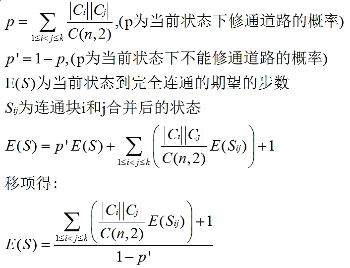

# The 2006 Northeastern Europe Regional Contest

<table>
<thead>
<th width='40px' align='center'>Id</th>
<th width='500px' align='left'>Problem</th>
<th width='130px' align='left'>Link</th>
<th width='80px' align='left'>Code</th>
</thead>
<tbody>
<tr><td>A</td>   <td>ASCII Art</td>   <td>LA 3702</td>   <td><a href='la3702.cpp'>C++</a></td>   </tr>
<tr><td>B</td>   <td>Billing Tables</td>   <td>LA 3703</td>   <td><a href='la3703.cpp'>C++</a></td>   </tr>
<tr><td>C</td>   <td>Cellular Automaton</td>   <td>LA 3704</td>   <td><a href='la3704.cpp'>C++</a></td>   </tr>
<tr><td>D</td>   <td>Driving Directions</td>   <td></td>   <td></td>   </tr>
<tr><td>E</td>   <td>Exchange</td>   <td>LA 3706</td>   <td><a href='la3706.cpp'>C++</a></td>   </tr>
<tr><td>F</td>   <td>Fool's Game</td>   <td></td>   <td></td>   </tr>
<tr><td>G</td>   <td>Graveyard</td>   <td></td>   <td></td>   </tr>
<tr><td>H</td>   <td>Hard Life</td>   <td></td>   <td></td>   </tr>
<tr><td>I</td>   <td>Interconnect</td>   <td>LA 3710</td>   <td><a href='la3710.cpp'>C++</a></td>   </tr>
<tr><td>J</td>   <td>Java vs C++</td>   <td></td>   <td></td>   </tr>
<tr><td>K</td>   <td>Kickdown</td>   <td></td>   <td></td>   </tr>
</tbody>
</table>

注意：本套题目POJ也能提交，但POJ里面每一组数据是独立一个文件，而Live Archive则是所有数据在同一个文件里面。所以输入输出有所不一样。

## Problem A. ASCII Art

OJ and Id							| Language	| Status        | Run Time / Limit            |
-----------------------				| --------	| ------------- | -------------               |
ACM-ICPC Live Archive 3702			| C++		| Accepted		| 0.023 s / 3.000 s			  |

##### Summary
给出一个格子图，再给出一个简单多边形，多边形的顶点都在格点上，问每个格子被多边形覆盖的面积是多少？ 
##### Solution

对这个简单多边形进行梯形剖分，将多边形剖分成许多直角梯形。剖分出来的梯形只有一条边与格子的边线不重合，因此计算起来十分方便。用剖分出来的梯 形分别和梯形相交的格子进行求交，求出有向面积。求交既可以分类讨论，也可以使用半平面交。

上图：进行梯形剖分后，面积为正的梯形。

上图：进行梯形剖分后，面积为负的梯形。

面积的正负取决于多边形的某条边的方向。如果xi\<xi+1，则面积为正。否则面积为负。每次算出这个有向面积，累计到相应的格子即可。

最后处理时要注意精度问题。 

## Problem B. Billing Tables

OJ and Id							| Language	| Status        | Run Time / Limit            |
-----------------------				| --------	| ------------- | -------------               |
ACM-ICPC Live Archive 3703			| C++		| Accepted		| 0.073 s / 3.000 s			  |

##### Solution
按照题意, 按顺序枚举每个前缀. 

## Problem C. Cellular Automaton

OJ and Id							| Language	| Status        | Run Time / Limit            |
-----------------------				| --------	| ------------- | -------------               |
ACM-ICPC Live Archive 3704			| C++		| Accepted		| 0.733 s / 18.000 s		  |

##### Solution
对于每一次变换, 实质是计算一个矩阵乘法:M\*A=A.在矩阵M中, 只存在0和1两种元素. 当min(|i-j|, n-|i-j|) <= d时, M[i,j]=1, 否则M[i,j]=0. 那么对于k次变换, 就是计算这个矩阵M的k次方, 再乘以A.

但是由于给出的矩阵很大(达到500), 普通的矩阵乘法的复杂度为O(n3), 必定会超时. 注意到这个矩阵的特殊性质, 下一行必定是上一行偏移一个格子得到的. 这样的矩阵叫做循环矩阵, 可以利用其特殊性质, 在O(n2)的时间内计算乘法. 

## Problem E. Exchange

OJ and Id							| Language	| Status        | Run Time / Limit            |
-----------------------				| --------	| ------------- | -------------               |
ACM-ICPC Live Archive 3706			| C++		| Accepted		| 0.265 s / 4.500 s			  |

##### Solution
使用堆来进行模拟. 最大堆模拟买单, 最小堆模拟卖单. 

## Problem G. Graveyard

OJ and Id							| Language	| Status        | Run Time / Limit            |
-----------------------				| --------	| ------------- | -------------               |
ACM-ICPC Live Archive 3708			| C++		| Accepted		| 0.000 s / 3.000 s			  |

##### Solution
简单题，略。

## Problem I. Interconnect

OJ and Id							| Language	| Status        | Run Time / Limit            |
-----------------------				| --------	| ------------- | -------------               |
ACM-ICPC Live Archive 3710			| C++		| Accepted		| 0.146 s / 3.000 s			  |

##### Summary
一个王国里面有n个城市(n <= 30), 已经知道有m条公路是尚能使用的. 工人们每年修一条路, 而且工人们修路很随机. 他们会随机找两个城市, 不管这两个城市是否已经连通或者有路, 都照修这条路. 问要使所有的城市连通, 数学期望是多少年? 
##### Solution
典型的数学期望问题. 公路的维修和城市的标号没有关系. 只和当前的每个连通块的大小有关系. 令S表示当前状态, 那么S就是一些连通块的集合{|C1|, |C2|, |C3|...}, 表示当前有C1个城市连到一块, C2个城市连到另一块, C3个城市连到另一块. 为了不重复表示状态, 规定S中的连通块的排列是从小到大的.

对于当前状态, 每次修路, 是从所有的城市里面选两个城市进行修路. 因此修通连通块i和j的概率为:|Ci|\*|Cj|/C(n,2).设E(Status)为某个状态Status修到完全连通的期望的步数. 那么明显E(end)为0, end是终止状态, 就是只有一个大小为n的连通块. 

这个过程可以使用记忆化搜索解决. 由于状态比较难表示, 因此可以使用一个Hash表来保存状态. 为了保险起见, 我使用了双Hash的方法. 

## Problem J. Java vs C++

OJ and Id							| Language	| Status        | Run Time / Limit            |
-----------------------				| --------	| ------------- | -------------               |
ACM-ICPC Live Archive 3711			| C++		| Accepted		| 0.000 s / 3.000 s			  |

##### Solution
模拟题，直接做。

