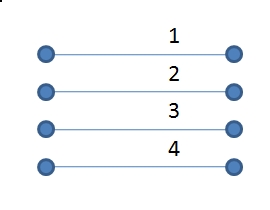
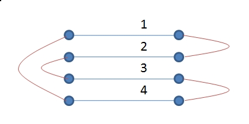
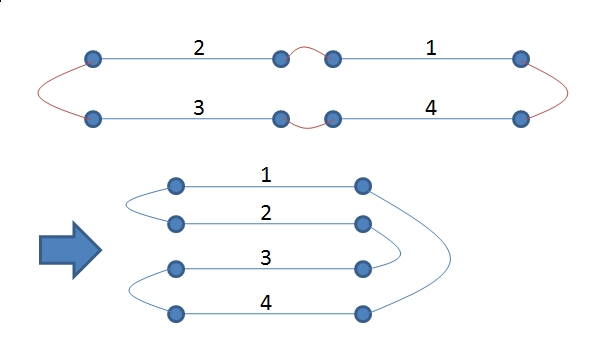
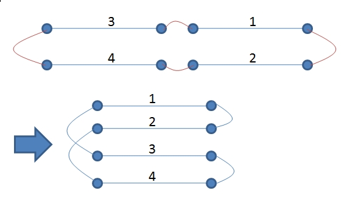

# The 2006 Rocky Mountain Regional Contest

<table>
<thead>
<th width='40px' align='center'>Id</th>
<th width='500px' align='left'>Problem</th>
<th width='130px' align='left'>Link</th>
<th width='80px' align='left'>Code</th>
</thead>
<tbody>
<tr><td>A</td>   <td>Bridge Bidding</td>   <td></td>   <td></td>   </tr>
<tr><td>B</td>   <td>Baskets of Gold Coins</td>   <td>LA 3576</td>   <td><a href='la3576.cpp'>C++</a></td>   </tr>
<tr><td>C</td>   <td>Toothpick Arithmetic</td>   <td></td>   <td></td>   </tr>
<tr><td>D</td>   <td>Human Knot</td>   <td></td>   <td></td>   </tr>
<tr><td>E</td>   <td>Permutation Recovery</td>   <td></td>   <td></td>   </tr>
<tr><td>F</td>   <td>Marbles in Three Baskets</td>   <td></td>   <td></td>   </tr>
<tr><td>G</td>   <td>Doors and Penguins</td>   <td></td>   <td></td>   </tr>
<tr><td>H</td>   <td>Knots</td>   <td>LA 3582</td>   <td><a href='la3582.cpp'>C++</a></td>   </tr>
<tr><td>I</td>   <td>String Equations</td>   <td></td>   <td></td>   </tr>
</tbody>
</table>

## Problem B. Baskets of Gold Coins
##### Solution

很简单的推导。 

## Problem H. Knots

OJ and Id							| Language	| Status        | Run Time / Limit            |
-----------------------				| --------	| ------------- | -------------               |
ACM-ICPC Live Archive 3582			| C++		| Accepted		| 1 s / 3.000 s			  |

##### Summary
给出一个有2N个节点图：

现在左边连N/2条线，右边连N/2条线，问连成一个大圈的概率，例如：

##### Solution

概率为连成圈的方案数除以总方案的方案数。总方案的数目计算如下：

左边的点1和下面的点2，点3...点n相连，方案为(n-1)，如此重复，取未连的点与下面未连的点相连，一路这样做下去，左边的总方案 数为：1×3×5....×(n-3)×(n-1)。右边同样如此，那么两边的总方案数就是(1×3×5....×(n-3)×(n-1))2

连成圈的方案数比较难想，如图，假设已经连成了一个圈。然后要把这些圈排成原来的形状，1号线在第一层，2号线放在第二层，3号线放在第三层....：

那么可以看出，就是这个圈有多少种排列方法就是点为n的圆排列的方法。圆排列的组合公式为(n-1)!。那么得到最后的答案为：

p=(n-1)!/((1×3×5....×(n-3)×(n-1))2)

式子上下有不少相同的项，可以消去。 

