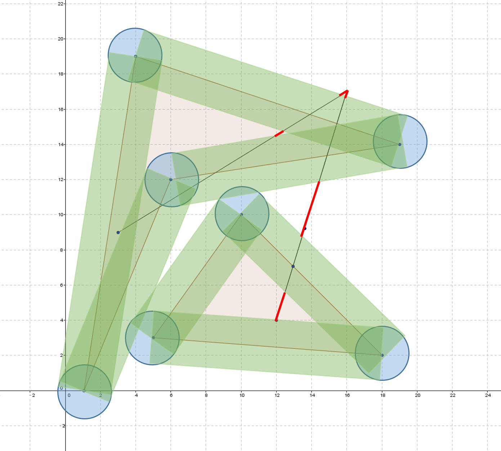

# The 2007 Northwestern Europe Regional Contest

<table>
<thead>
<th width='40px' align='center'>Id</th>
<th width='500px' align='left'>Problem</th>
<th width='130px' align='left'>Link</th>
<th width='80px' align='left'>Code</th>
</thead>
<tbody>
<tr><td>A</td>   <td>Assemble</td>   <td><a href='http://poj.org/problem?id=3497'>POJ 3497</a></td>   <td><a href='la3971.cpp'>C++</a></td>   </tr>
<tr><td>B</td>   <td>March of the Penguins</td>   <td><a href='http://poj.org/problem?id=3498'>POJ 3498</a></td>   <td><a href='la3972.cpp'>C++</a></td>   </tr>
<tr><td>C</td>   <td>Containers</td>   <td><a href='http://poj.org/problem?id=3499'>POJ 3499</a></td>   <td><a href='la3973.cpp'>C++</a></td>   </tr>
<tr><td>D</td>   <td>Youth Hostel Dorm</td>   <td></td>   <td></td>   </tr>
<tr><td>E</td>   <td>Escape from Enemy Territory</td>   <td><a href='http://poj.org/problem?id=3501'>POJ 3501</a></td>   <td><a href='la3974.cpp'>C++</a></td>   </tr>
<tr><td>F</td>   <td>Flight Safety</td>   <td><a href='http://poj.org/problem?id=3502'>POJ 3501</a></td>   <td><a href='la3975.cpp'>C++</a></td>   </tr>
<tr><td>G</td>   <td>Summits</td>   <td><a href='http://poj.org/problem?id=3503'>POJ 3502</a></td>   <td><a href='la3976.cpp'>C++</a></td>   </tr>
<tr><td>H</td>   <td>Obfuscation</td>   <td><a href='http://poj.org/problem?id=3504'>POJ 3504</a></td>   <td><a href='la3978.cpp'>C++</a></td>   </tr>
<tr><td>I</td>   <td>Tower Parking</td>   <td><a href='http://poj.org/problem?id=3505'>POJ 3505</a></td>   <td><a href='la3979.cpp'>C++</a></td>   </tr>
<tr><td>J</td>   <td>Walk</td>   <td><a href='http://poj.org/problem?id=3506'>POJ 3505</a></td>   <td><a href='la3980.cpp'>C++</a></td>   </tr>
</tbody>
</table>

本套题目由于完成时间久远，所以部分题目没有详细的解说。
## Problem A. Assemble

OJ and Id							| Language	| Status        | Run Time / Limit            |
-----------------------				| --------	| ------------- | -------------               |
ACM-ICPC Live Archive 3971			| C++		| Accepted		| 0.022 s / 3.000 s			  |

##### Solution
二分。

## Problem B. March of the Penguins

OJ and Id							| Language	| Status        | Run Time / Limit            |
-----------------------				| --------	| ------------- | -------------               |
ACM-ICPC Live Archive 3972			| C++		| Accepted		| 0.303 s / 3.000 s			  |

##### Solution
网络流。

## Problem C. Containers

OJ and Id							| Language	| Status        | Run Time / Limit            |
-----------------------				| --------	| ------------- | -------------               |
ACM-ICPC Live Archive 3973			| C++		| Accepted		| 0.033 s / 3.000 s			  |

##### Solution
略。

## Problem E. Escape from Enemy Territory

OJ and Id							| Language	| Status        | Run Time / Limit            |
-----------------------				| --------	| ------------- | -------------               |
ACM-ICPC Live Archive 3974			| C++		| Accepted		| 0.349 s / 3.000 s			  |

##### Solution
二分答案+BFS。

## Problem F. Flight Safety

OJ and Id							| Language	| Status        | Run Time / Limit            |
-----------------------				| --------	| ------------- | -------------               |
ACM-ICPC Live Archive 3975			| C++		| Accepted		| 0.093 s / 3.000 s			  |

##### Summary
给出一条航线（由若干个点连接而成，点数目不多于20），以及若干个大陆（一个简单多边形，顶点数目不多于30，顶点的顺序有可能是顺时针或逆时针，大陆的数目不多于20个）。求航线离大陆最远的点到大陆的距离。

##### Solution
复杂的计算几何题。

基本思路是二分一个距离d，然后把这些大陆的形状向外“扩展”d，看看扩展后能不能覆盖整条航线。如果不行，则说明d不够大。下一轮二分就做出适当调整。虽然看似思路很清晰明确，但实现起来并不容易，很容易会把代码写得很长很长。

解题的关键在于如何把多边形往外“扩展”距离d。思路的关键是：实际上我们并不关心扩展后的形状如何，而只关心扩展后能不能覆盖整条航线。容易知道扩展以后的形状会有三部分：

1. 边扩展出来的是矩形。
2. 顶点扩展出来的是圆形，半径为d。
3. 还有简单多边形自己。

扩展以后的形状会有重合，但它就是上述三个部分的“并”。对于一个简单多边形来说，我们只需要判断这三个部分是否覆盖航线即可（虽然这个判断会有重复）。如果所有的多边形扩展后得到的这些矩形、圆形还有本身的多边形都无法覆盖整条航线，那么就说明距离d不够大大。下图展示了多边形往外扩展距离d之后的情形：

于是问题就转化为求线段和矩形、圆形以及简单多边形的交。线段与矩形及圆形的求交比较容易做，但与简单多边形求交则相当麻烦。如果能避免则最好。实际上我们发现，航线被扩展所得的矩形和圆形所覆盖后的剩下的部分是一堆散乱的线段，这个集合记作Left（图中红色的线段）。这些线段要么完全在原来的简单多边形里面（图中有两个），要么和简单多边形完全分离（图中有三个）。也就是说，如果Left里面存在一条线段S，与所有的简单多边形都分离，那么就可以说明扩展的距离d不够大，无法覆盖整条航线。要判断S是否与某个简单多边形分离是相当简单的事情，只需要判断S是否有端点在多边形内部即可（注意：多边形的内部包括多边形的边）。综上所述，这个题目的主要几何算法是：

1. 求线段与矩形的交点。
2. 求线段与圆的交点。
3. 判断点是否在简单多边形里面。
4. 向量旋转，用于扩展多边形，实际上旋转90度是很简单的。
5. 对覆盖的区间进行排序，找出航线上没被覆盖的区间。

以上都是一些最常见的计算几何算法。可以直接使用。

实现的细节：

1. 扩展边的时候，理论上只需要往多边形外部扩展即可。但题目有个麻烦的地方：题目的多边形输入既可以是顺时针也可以是逆时针。要做到往外扩展的话要作预处理，把顶点的顺序统一成顺时针或逆时针。我一开始写的代码就是这么做。后来看了标程才发现更加聪明的做法。扩展的时候直接把边向内和向外同时扩展。这样就不需要判多边形是断顺时针还是逆时针了。
2. 注意精度。
3. 标程里面在运算里面用了直线的参数方程来表示直线。这样线段的点都可以用浮点数来表示。我则没有这么处理。

## Problem G. Summits

OJ and Id							| Language	| Status        | Run Time / Limit            |
-----------------------				| --------	| ------------- | -------------               |
ACM-ICPC Live Archive 3977			| C++		| Accepted		| 0.206 s / 3.000 s			  |

##### Summary
有一个N*M(N<=500, M<=500)的方阵，每一个格子的数字代表一个高度。现在给出d-summit的定义：如果某个格子（其高度为h），如果它必须要通过高度小于或等于h-d的格子，才能到达比自己高的格子，那么称它是一个d-summit。

给出这个方阵和d，问里面有多少个d-summit。

##### Solution
用BFS做Floodfill。

首先，能够成为summit的点，必定是高度比较高的。于是先把所有点的坐标和高度放到一个列表里面，从高到低排序。

然后依次从排序结果里面选出点X，判断它能不能通过高度大于是不是summit，根据d-summit的定义，如果格子X通过高度大于hX-d的路径能够到达一个更高的格子的话，那它就不是summit。这个可以从X开始作BFS判断。

明显，这个点X找summit的过程中，所访问的过点，都不可能是summit（除非这个点的高度和X一样）。所以在BFS过程中，我们需要把这些格子标记出来。之后就无需对这些格子做BFS，因为他们都不会是summit。

BFS从X扩展邻居的四个格子时，会有以下可能：

1. 邻居点的高度<=hX - d。这时遇到了一个“沟”，不需要扩展。
2. 邻居点在当前这一轮BFS被搜索过的，跳过。
3. 邻居点在之前的BFS被搜索过的。如果遇到这种情况，那么就说明X不是summit。因为如果这个邻居点之前被搜索过的话，就说明这个邻居点必定通向某个点Y，hY > hX（因为之前从高到低的排序）。也就是说这个邻居点的高度必定大于hx - d。这意味着，X必定可以通过这个邻居点到达一个更高的点，且这条路径上所有点的高度都大于hX - d。所以，X点不是summit。

PS：这个题目也可以用是并查集解决。

## Problem H. Obfuscation

OJ and Id							| Language	| Status        | Run Time / Limit            |
-----------------------				| --------	| ------------- | -------------               |
ACM-ICPC Live Archive 3978			| C++		| Accepted		| 0.019 s / 3.000 s			  |

##### Solution
动态规划。

## Problem I. Tower Parking

OJ and Id							| Language	| Status        | Run Time / Limit            |
-----------------------				| --------	| ------------- | -------------               |
ACM-ICPC Live Archive 3979			| C++		| Accepted		| 0.003 s / 3.000 s			  |

##### Solution
简单模拟题。

上下电梯所花的时间仅仅与每一层楼有多少辆车有关。然后每一层楼的车在转盘上移动的时间的计算是独立的，可以逐层计算。计算转盘的耗时时，可以想象是出口在转动，不停地转到需要出来的车的位置，而不是转盘在转动。这样设计出来的算法会非常简单。

## Problem K. Walk

OJ and Id							| Language	| Status        | Run Time / Limit            |
-----------------------				| --------	| ------------- | -------------               |
ACM-ICPC Live Archive 3980			| C++		| Accepted		| 0.073 s / 3.000 s			  |

##### Summary
地图上有N组等高线（N<=2500）。等高线用多边形表示，其顶点数目不超过2000，所有坐标都是整数。而且保证这些等高线都合法。现在要从A点(0, 0)走到B点(100 000, 0)，求一种方案，使上山的高度和下山高度最小。

##### Solution
计算几何。

等高线最重要的性质就是他们之间不会相交。他们之间关系可以抽象为简单的拓扑关系：包含与被包含。因此可以得出结论：使在高度上的移动距离最小的方案是唯一的，做法就是不要穿越多余的等高线。

一种比较直观的做法是：连接起点和终点，得线段AB（其方程为y = 0）。可以得知，从A到B必须要经过满足这些条件的等高线：

1. A在等高线内或B在等高线内。否则这个等高线所形成的“小山丘”或“小盆地”就不在路线上，可以躲开。
2. 这条等高线与AB的交点数目必须是奇数个。否则这个等高线要么同时包含A和B，要么根本不包含A或B。这样的等高线是没必要穿越。

条件1的判断方法就是经典的判断点是否在简单多边形内部的问题。其中一种算法是在该点向外作一条无穷远的射线，看看射线与多边形交点数目的奇偶性。如果交点是奇数，那么点就在多边形内部。实际上条件1和2是可以同时判断的（可以令y=0作为那条无穷圆的射线）。因此，题目的主要计算就是求直线y=0与许多线段交点。线段与直线相交会有两种很麻烦的情况，第一是共线，第二是不规则相交（交点恰好是线段的端点）。这两种情况都会干扰交点数目的正确性。因此解题时有一个很重要的技巧：就是把AB向上“挪动”一点点，也就是用y=0.1来代替y=0。因为题目说明给的坐标都是整数。因此用y=0.1和这些线段求交点的话，就不会出现上述两种麻烦的情况。

求出哪些等高线是必须穿越以后，要上山多少和下山多少就很容易求了。可以认为：如果等高线与AB有多个交点，那么肯定是在最右的那个交点穿越的。而且内层等高线的最右点肯定在外层等高线的左侧。因此可以把这些等高线与AB交点的最右点排序，就可以知道穿越的顺序。
