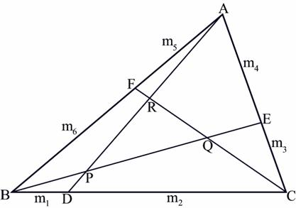
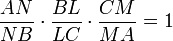
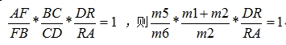
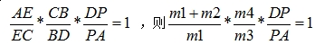

# The 2008 Asia Regional Contest - Kuala Lumpur

<table>
<thead>
<th width='40px' align='center'>Id</th>
<th width='500px' align='left'>Problem</th>
<th width='130px' align='left'>Link</th>
<th width='80px' align='left'>Code</th>
</thead>
<tbody>
<tr><td>A</td>   <td>ASCII Diamondi</td>   <td>LA 4403</td>   <td><a href='la4403.cpp'>C++</a></td>   </tr>
<tr><td>B</td>   <td>Match Maker</td>   <td>LA 4404</td>   <td><a href='la4404.cpp'>C++</a></td>   </tr>
<tr><td>C</td>   <td>Tariff Plan</td>   <td>LA 4405</td>   <td><a href='la4405.cpp'>C++</a></td>   </tr>
<tr><td>D</td>   <td>Irreducible Fractions</td>   <td></td>   <td></td>   </tr>
<tr><td>E</td>   <td>Gun Fight</td>   <td>LA 4407</td>   <td><a href='la4407.cpp'>C++</a></td>   </tr>
<tr><td>F</td>   <td>Unlock the Lock</td>   <td>LA 4408</td>   <td><a href='la4408.cpp'>C++</a></td>   </tr>
<tr><td>G</td>   <td>Ironman Race in Treeland</td>   <td>LA 4409</td>   <td><a href='la4409.cpp'>C++</a></td>   </tr>
<tr><td>H</td>   <td>Shooting the Monster</td>   <td></td>   <td></td>   </tr>
<tr><td>I</td>   <td>Addition-Subtraction Game</td>   <td></td>   <td></td>   </tr>
<tr><td>J</td>   <td>The Great Game</td>   <td></td>   <td></td>   </tr>
<tr><td>K</td>   <td>Triangle Hazard</td>   <td>LA 4413</td>   <td><a href='la4413.cp'>C++</a></td>   </tr>
</tbody>
</table>

## Problem A. ASCII Diamondi
##### Solution
先把x,y分别对2n-1求余，然后找出x，y与对应的字符的关系即可。 

## Problem B. Match Maker

##### Summary
给出一些男士的名字和女士的名字,以及每个男士所喜爱的女士的名字的列表.问:每个男士都匹配到自己喜欢的女士的匹配方案数有多少,并要求给出字典 序最小的一种方案. 
##### Solution
第一问为经典的状态压缩DP，使用DP[i][st]表示选择到第i个人的时候，对方状态为st的方案数。 第二问可以在DP的过程中同时完成。稍作排序预处理可得字典序最小的方案。 

## Problem C. Tariff Plan

##### Solution
简单题，直接计算即可。 

## Problem E. Gun Fight
##### Solution
从图上看是一个二分匹配的问题，塔少的一方匹配塔多的一方。分界线左右可以使用叉积的正负判断。 

## Problem F. Unlock the Lock
##### Solution
简单BFS题，直接搜索即可。 

## Problem G. Ironman Race in Treeland

##### Summary
给出一棵N个节点的树(N<=30000)，树上每条边都有一个耗费和长度。要求出一条路径，使路径的总耗费不超过给定的M，且长度最大。 
##### Solution

题目规模很大，需要使用树上的分治算法。算法的主框架，选根过程与Lou Tiancheng的TREE差不多，不再详述。下面主要讲解统计的方法：

使用数组Path[N]记录从当前根root到达其子树，耗费小于M的路径，流程如下：

1. begin=end=0
2. 遍历子节点，将合法路径保存在begin到end之间。
3. 如果遍历的是第一个子树，那么不存在任何横跨根节点的路径。
4. 如果遍历的不是第一个子树，那么Path数组中，0至begin-1保存的是之前的子树得到的合法路径，begin至end保存的是当前子树得到的合法路 径。那么只要统计两个区间的组合，得到的耗费不超过M的最长路径即可。之所以要这样做，是因为如果一次过将所有路径全部弄进Path数组，得到的路径有可 能是同一棵子树里面出来的。
5. begin=end，如果仍有子树，跳到第二步。 

统计Path数组的最优路径的时候，显然不能两两枚举组合，这样复杂度会很高。在题目中，路径和耗费没有任何关系。但是，明显，如果路径A的长度是 5，耗费是4，路径B的长度是4，耗费是5，那么路径B是不可能成为最优路径的。对于Path数组，在统计前，我们要使0至begin这一部分和 begin至end分别具有单调性，也就是路径长度要和耗费成正比。要做到这点，可以先把路径按耗费从小到大排序，如果耗费相同，则把长度长的排在前面。 排序后，就可以通过线性扫描，将无效的路径删除，使0至begin这一部分和begin至end分别具有单调性。

获得单调性之后，统计这一部分也就可以通过线性扫描解决了。由于Path数组的两部分都是按照耗费排序的，头指针p1指向0，尾指针p2指 向end，一起向中间“夹”，就可以统计出当前分治的最优路径。 

## Problem K. Triangle Hazard

##### Summary
如图：

给出P,Q,R的坐标，以及比例关系m1,m2,m3,m4,m5,m6，要求出A,B,C的坐标。 
##### Solution
背景知识：梅涅劳斯定理。如果一直线与三角形ABC的边BC、CA、AB分别交于L、M、N，则有：

观察原图，要求A点的坐标，必须知道RA的长度，根据梅涅劳斯定理定理，对三角形ABD和截线CRF：

类似地对三角形ACD和截线BPE

设AR长度为x，DP长度为y，已知RP长度，代入原式DP,PA,DP,RA，可得二元方程组，容易解决。

由此可得 AR:RP, 则可得A点坐标。其他点如此类推。 

