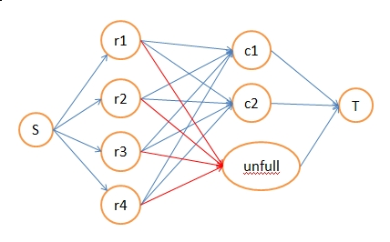

# The 2008 Asia Regional Contest - Taipei

<table>
<thead>
<th width='40px' align='center'>Id</th>
<th width='500px' align='left'>Problem</th>
<th width='130px' align='left'>Link</th>
<th width='80px' align='left'>Code</th>
</thead>
<tbody>
<tr><td>A</td>   <td>Dangerous Tunnels</td>   <td>LA 4259</td>   <td><a href='la4259.cpp'>C++</a></td>   </tr>
<tr><td>B</td>   <td>Fortune Card Game</td>   <td>LA 4260</td>   <td><a href='la4260.cpp'>C++</a></td>   </tr>
<tr><td>C</td>   <td>Trip Planning</td>   <td>LA 4261</td>   <td><a href='la4261.cpp'>C++</a></td>   </tr>
<tr><td>D</td>   <td>Road Networks</td>   <td>LA 4262</td>   <td><a href='la4262.cpp'>C++</a></td>   </tr>
<tr><td>E</td>   <td>Early-Morning Pickup</td>   <td>LA 4263</td>   <td><a href='la4263.cpp'>C++</a></td>   </tr>
<tr><td>F</td>   <td>Message</td>   <td>LA 4264</td>   <td><a href='la4264.cpp'>C++</a></td>   </tr>
<tr><td>G</td>   <td>Lost Treasure</td>   <td></td>   <td></td>   </tr>
<tr><td>H</td>   <td>Space Elevator</td>   <td></td>   <td></td>   </tr>
<tr><td>I</td>   <td>Finding The Heaviest Path</td>   <td>LA 4267</td>   <td><a href='la4267.cpp'>C++</a></td>   </tr>
<tr><td>J</td>   <td>Bonus Adjustment</td>   <td>LA 4268</td>   <td><a href='la4268.cpp'>C++</a></td>   </tr>
</tbody>
</table>

## Problem A. Dangerous Tunnels

##### Summary
给出一个有向图，每条边都带权值。要找出K条S到T的路径，使所有路径的边上的权值的最大值最小。输出该权值，如果方案不存在则输出no solution。
##### Solution
可以将所有的边按照大小从小到大排序。然后每次二分一个值，使用网络流判定。将所有合条件的边加入到图中，建立网络流图，由于顶点不能重复，因此需要把顶点拆成流量为1的边。若最大流大于等于K，则说明可行，否则说明不可行。

## Problem B. Fortune Card Game
##### Solution

这个题目可以使用动态规划解决。

令字符串为S，设DP[pos][card]为处理到字符串的pos位置，使用card，能够获得的最大值。首先S[pos]要与卡的字母相同，此外，从前面的DP[pos-1]向DP[pos]转移时，要确保之前的card的next值和当前的卡的编号相同。

最好进行一下预处理，将卡与卡之间的推导关系预处理出来，用一个类似图的邻接链表的结构保存即可。

## Problem C. Trip Planning
##### Solution
简单动态规划，定义DP[x]为走到x的时候最小的代价即可。DP[x] = min(DP[i] + (100-sum[i to x])2), i = 1 to x - 1。如果大小相等则比较size，用pre记录当前状态是由之前哪个状态转移过来的。如果大小也相等，则比较pre。

## Problem D. Road Networks
##### Solution
两次DFS可求有向图的强连通分量的数目。

## Problem E. Early-Morning Pickup

##### Summary
有N个节点（N<=512），由一些道路相连。有个公司负责修电脑，每天早上8点钟派出R个维修代表。这些维修代表要从他们的家到达他们的办公室。此外，有C个顾客的电脑坏了，还有M个维修站，这些维修代表要在他们回办公室的路上到这些顾客的家里拿电脑，把这些电脑送到维修站，再回到办公室。每个维修代表最多只能带一台电脑，且维修代表的数目不小于顾客的数目。因此有些维修代表可以不用帮助顾客，直接回办公室。

现在已知每个维修代表家，办公室所在的节点，以及顾客在哪些节点，维修站在哪些节点，且每条道路都有个时间耗费。问：要完成所有顾客的电脑送修任务，以及使所有维修代表到达办公室，每个维修代表最小要耗费多少时间？答案向上取整，从08:00算起。
##### Solution
可以使用Floyd对题目的数据进行预处理，然后使用费用流或KM匹配的办法求出总共要耗费的时间。这里使用的是费用流。

使用Floyd能够获得每个点对之间的最短路，那么就可以得到维修代表ri从家里出发，处理顾客cj，然后再上班，所花费的总时间。这里要枚举维修代表所要到完顾客家后所要到的维修站。

然后可以如下建立网络流图，求出来的费用就是总共的时间。

在这个网络流图中，除了unfull到T的那条边之外，所有边的流量都是1。r1c1,r1c2...等边的费用值就是上面所说的维修代表ri处理顾客cj的最小耗费。由于有的维修代表不用处理顾客，直接到办公室，因此ri到unfull的费用值就是该维修代表直接从家到维修站的时间。 unfull到T的这条边的流量是nr-nc，也就是维修代表的数目减去顾客的数目，确保不能有过多的维修代表直接去办公室，不处理顾客的维修。

## Problem F. Message
##### Solution
直接模拟即可。

可以先把字母的旋转后的图形预处理出来。

## Problem I. Finding The Heaviest Path

##### Solution
直接DFS统计即可。 

## Problem J. Bonus Adjustment

##### Solution

可以对这个题目建立网络流模型来解决。

首先把所有的数字向下取整（floor函数），对于每一行，每一列，将多出来的小数位进行累加，之后就相当于对于每一行和每一列，将这些小数位的和进行重新分配给行里面或列里面的数字，且分配到每个节点，要么是1，要么是0。之后可以进行网络流建图，处理这些分配关系。

网络流图中：S为起点，T为终点。1-n代表行，n+1-m+n代表列。S到1-n，连边，边权为小数位的累加（累加出来必定是整数）。n+1-n+m连边，边权也是小数位的累加。最后，代表第i行和代表第j列的节点连边（如果矩阵中G[i][j]是一个整数则不需要，因为这个数字不需要 “重分配”），边权为1，代表这个节点有可能需要重新分配一个附加值1。

最后检查最大流是否和所有行需要分配的小数位和相等，如果不等则证明没有存在的方案。否则输出方案，如果代表G[i][j]的边的流量为1，那么说明这条边需要进位，向上取整，否则就向下取整。

