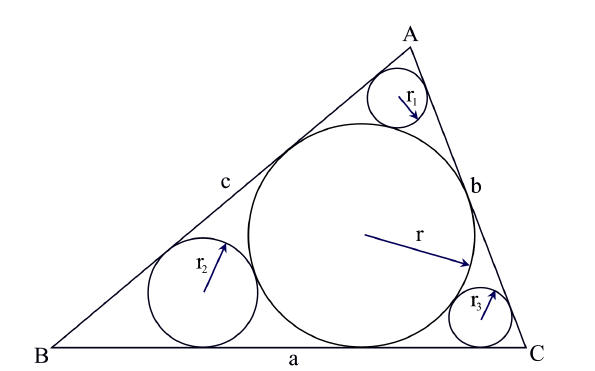
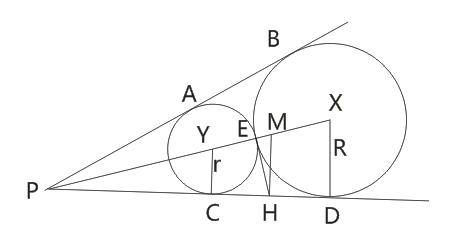

# The 2009 Asia Regional Contest - Phuket
<table>
<thead>
<th width='40px' align='center'>Id</th>
<th width='500px' align='left'>Problem</th>
<th width='130px' align='left'>Link</th>
<th width='80px' align='left'>Code</th>
</thead>
<tbody>
<tr><td>A</td>   <td>Airplane Parking</td>   <td>LA 4712</td>   <td><a href='la4712.cpp'>C++</a></td>   </tr>
<tr><td>B</td>   <td>Elias Omega Coding</td>   <td>LA 4713</td>   <td><a href='la4713.cpp'>C++</a></td>   </tr>
<tr><td>C</td>   <td>In-circles Again</td>   <td>LA 4714</td>   <td><a href='la4714.cpp'>C++</a></td>   </tr>
<tr><td>D</td>   <td>Rating Hazard</td>   <td></td>   <td></td>   </tr>
<tr><td>E</td>   <td>Relational Operators</td>   <td>LA 4716</td>   <td><a href='la4716.cpp'>C++</a></td>   </tr>
<tr><td>F</td>   <td>Your Ways</td>   <td></td>   <td></td>   </tr>
<tr><td>G</td>   <td>Hexagonal Sticks</td>   <td></td>   <td></td>   </tr>
<tr><td>H</td>   <td>Buy Your House</td>   <td></td>   <td></td>   </tr>
<tr><td>I</td>   <td>Synnerg Lifeform</td>   <td></td>   <td></td>   </tr>
<tr><td>J</td>   <td>Nowhere Money</td>   <td>LA 4721</td>   <td><a href='la4721.cpp'>C++</a></td>   </tr>
<tr><td>K</td>   <td>Highway Patrol</td>   <td></td>   <td></td>   </tr>
</tbody>
</table>

## Problem A. Airplane Parking

##### Solution
动态规划。 

## Problem B. Elias Omega Coding

##### Solution
（略）

## Problem C. In-circles Again

##### Summary
给出一个三角形及其内切圆，如图，知道r,r1,r2,r3的长度，求三角形的面积。 

##### Solution

如图：由几何知识得，两个圆外切，无论其如何放置，PA的长度都是固定的。如果，知道R与r，可以求出PB(或PD)。

设EH为两个圆的公切线，因为PCD为圆X与圆Y的公切线，因此有EH=CH=DH，且EH垂直于XY，因为H为CD的中点，因此可以作一 条平行线MH，平行于XD，也平行于YC。那么M就是XY的中点。

设EH的长度为x，EM的长度为(R+r)/2-r，MH是中位线，长度为(R+r)/2。因此根据勾股定理可以得出方程：

((R+r)/2-r)2+x2=((R+r)/2)2

解出x后，很容易就通过相似三角形的比例关系得出PH的长度。如此类推，可以算出三角形三条边的长度，通过海伦定理可得面积。 

## Problem E. Relational Operators
##### Solution
秒杀题。

## Problem J. Nowhere Money
##### Solution
利用斐波拉契数列的特殊规律进行解题。 

