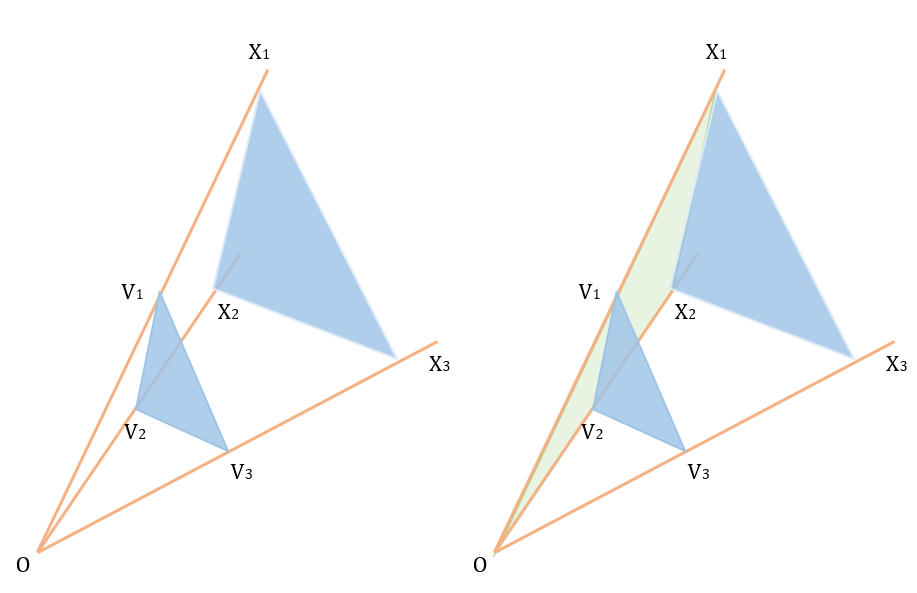

# The 2009 Asia Regional Contest - Shanghai

<table>
<thead>
<th width='40px' align='center'>Id</th>
<th width='500px' align='left'>Problem</th>
<th width='130px' align='left'>Link</th>
<th width='80px' align='left'>Code</th>
</thead>
<tbody>
<tr><td>A</td>   <td>Alice's Cube</td>   <td>LA 4743</td>   <td><a href='la4743.cpp'>C++</a></td>   </tr>
<tr><td>B</td>   <td>Brute-force Algorithm</td>   <td>LA 4744</td>   <td><a href='la4744.cpp'>C++</a></td>   </tr>
<tr><td>C</td>   <td>Compressed String</td>   <td>LA 4745</td>   <td><a href='la4745.cpp'>C++</a></td>   </tr>
<tr><td>D</td>   <td>Decrypt Messages</td>   <td></td>   <td></td>   </tr>
<tr><td>E</td>   <td>Exciting Time</td>   <td>LA 4747</td>   <td><a href='la4747.cpp'>C++</a></td>   </tr>
<tr><td>F</td>   <td>Flowers Placement</td>   <td></td>   <td></td>   </tr>
<tr><td>G</td>   <td>Game Simulator</td>   <td></td>   <td></td>   </tr>
<tr><td>H</td>   <td>Heroes Arrangement</td>   <td>LA 4750</td>   <td><a href='la4750.cpp'>C++</a></td>   </tr>
<tr><td>I</td>   <td>Island Explorer</td>   <td>LA 4751</td>   <td><a href='la4751.cpp'>C++</a></td>   </tr>
<tr><td>J</td>   <td>Jinyuetuan Puzzle</td>   <td>LA 4752</td>   <td><a href='la4752.cpp'>C++</a></td>   </tr>
</tbody>
</table>

## Problem A. Alice's Cube

OJ and Id							| Language	| Status        | Run Time / Limit            |
-----------------------				| --------	| ------------- | -------------               |
ACM-ICPC Live Archive 4743			| C++		| Accepted		| 0.033 s / 3.000 s			  |

##### Solution
本题使用BFS+状态压缩可以解决。可以如果单次搜索的话，时间复杂度是没有问题的。但是题目的CASE数目很多，如果每次都进行搜索，肯定会超时。考虑到题目状态数目不多，只有216个，因此可以考虑把所有状态的答案先算出来，然后再打表回答。实际上本题从初始状态搜索到终止状态，和从终止状态搜索到初始状态，是一样的。但是题目只有一个终止状态，因此可以从终止状态开始搜索，把所有状态的答案都算出来，之后打表即可。

## Problem B. Brute-force Algorithm

OJ and Id							| Language	| Status        | Run Time / Limit            |
-----------------------				| --------	| ------------- | -------------               |
ACM-ICPC Live Archive 4744			| C++		| Accepted		| 0.008 s / 3.000 s			  |

##### Solution
数论+矩阵乘法。

## Problem C. Compressed String

OJ and Id							| Language	| Status        | Run Time / Limit            |
-----------------------				| --------	| ------------- | -------------               |
ACM-ICPC Live Archive 4745			| C++		| Accepted		| 0.003 s / 3.000 s			  |

##### Solution
字符串展开后的规模十分巨大，因此是不可能展开后再进行比较。

标准的做法是二分一个答案X，然后再利用Hash来比较两个字符串的前X个字符是否一样。代码里面使用了一种等差数列的方法进行Hash，边递归边进行Hash。 

##### Credit
3xian

## Problem E. Exciting Time

OJ and Id							| Language	| Status        | Run Time / Limit            |
-----------------------				| --------	| ------------- | -------------               |
ACM-ICPC Live Archive 4747			| C++		| Accepted		| 0.285 s / 3.000 s			  |
HDU 3224							| C++		| Accepted		| 483 ms / 4000 ms		      |

##### Summary
模拟俄罗斯方块游戏，经过n(n<=30000)个方块下落后，求最终每一列的高度以及总积分。列数W不超过30000。
##### Solution
要用数据结构优化的模拟题。

题目的数据规模很大，过于暴力的方法很难AC。官方报告给出了一个大概的框架。这里详细叙述我的实现方法。

首先最好把所有骨牌的旋转预处理出来，可以把各种信息hard-coded在代码里面，这样可以减少编码的麻烦程度。

用W个栈表示每一列的状况，用来存储每一列里面哪些行有方块。方块数目为n的话，最坏情况下会有n\*4行。我们用一个大小为n\*4的数组rows表示每一行有多少个格子。

在游戏过程中，会不断有行被“删除”。清空的行不会被删除（这样会很花时间）。可以用rows数组标记哪些行被清空了。被清空的行在后面的操作将会被“无视”和“跳过”。

模拟每一个方块落下的过程如下：

1. 找出骨牌落下后的高度（注意跳过被清空的行）。
2. 把骨牌的格子放到栈里面去（同样注意跳过被清空的行）。
3. 检查骨牌的所改变的行，如果有满行（检查row[i]是否等于W)，就把这一行给“删除”。
4. 如果这一轮有行被清空了，则需要检查所有的栈。如果栈顶的行被清空了，就把它弹出。这样保证后面能够找到骨牌的高度。

题目最后要输出每一列的高度。只需要把被删除的行的编号排个序，二分查找一下每个栈顶的高度，即可知道前面分别有多少个行被删除。

## Problem H. Heroes Arrangement

OJ and Id							| Language	| Status        | Run Time / Limit            |
-----------------------				| --------	| ------------- | -------------               |
ACM-ICPC Live Archive 4750			| C++		| Accepted		| 0.176 s / 3.000 s			  |

##### Solution
先用三维计算几何预处理，然后再求图的最大团。题目的难点在于判断两个空间三角形是否互相“冲突”。

如图：原点为O的空间中有三角形V（顶点分别为V1，V2和V3）。把OV1，V2和V3等比例向远处延长，得到一个和V相似的三角形X。棱柱O-V1V2V3也与O-X1X2X3相似。

若要判断某三角形U是否与当前三角形V冲突，需要考虑这三种情况：

1. U在棱柱O-X1X2X3内部。可以把O和U的任意顶点x连线段，判断OUx是否和三角形V相交。
2. U的某条边和棱柱O-X1X2X3的侧面（侧面是指其中一个顶点是O的面，例如图中绿色的面）相交。这时需要判断U的任意边UxUx+1是否和这些侧面任意一个相交。
3. U的某个点与棱柱O-X1X2X3的侧面相接触。这时需要判断U所有顶点是否和这些侧面任意一个共面。

于是，这个问题转换成两个三维的判断：1. 线段是否和三维三角形相交。2. 四个点是否共面。这些三维问题可以通过扩展二维问题的解决思路得出方法。具体判断方法可以参见代码。

##### Credit
3xian

## Problem I. Island Explorer

OJ and Id							| Language	| Status        | Run Time / Limit            |
-----------------------				| --------	| ------------- | -------------               |
ACM-ICPC Live Archive 4751			| C++		| Accepted		| 0.346 s / 3.000 s			  |

##### Solution

计算几何问题。如果每对顶点之间都连边，规模很大，必定超时。可以考虑精简构图时的边数，然后再使用Kruskal最小生成树算法。实际上，设点P所在的直线为l1，在l1上，可以易得P只可能连它在l1上相邻的两个点，在l2上，可以对P作一条垂线到l2，垂足为P'，那么P只可能连l2上P'相 邻的两个点。这样进行连边，一个点最多只会产生4条边。之后求最小生成树即可。 

## Problem J. Jinyuetuan Puzzle

OJ and Id							| Language	| Status        | Run Time / Limit            |
-----------------------				| --------	| ------------- | -------------               |
ACM-ICPC Live Archive 4752			| C++		| Accepted		| 1.156 s / 3.000 s			  |

##### Solution

一个颇为麻烦的动态规划。由于在同一个时间内，可以先释放按键，然后再按下另一个按键，因此把一个时间点拆成两部分，第一部分专门用于释放按键，第二部分用于按下一个新的按键。使用dp[time][key]表示一个状态，表示时间time中，按下的组合为key（状态压缩表示）得到的最高分数。由于键冲突引起的结果是丢失分数。因此如果要达到最高分，那么必定不可能按下冲突的按键。具体处理看代码。 

