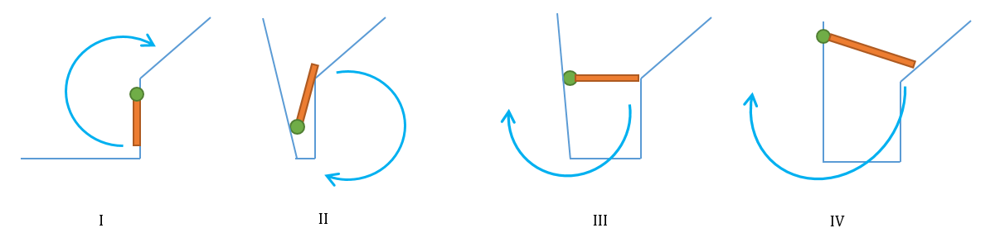

## 2007 Japan Domestic: Twirl Around

OJ and Id							| Language	| Status        | Run Time / Limit            |
-----------------------				| --------	| ------------- | -------------               |
POJ 3229							| C++		| Accepted		| 0 ms / 10000 ms	          |
Aizu OJ 1151						| C++		| Accepted		| 0.00 s / 8 s           	  |

##### Summary
给出一个顶点数为n(n<=100)的多边形。有一个长度为l的棍子， 一开始时，端点A在(0,0)上，端点B在(0,l)上。要求你模拟这个棍子在多边形里面作顺时针转动。求转动2 \* PI * r之后，端点A的位置坐标。

##### Solution
一道非常麻烦的计算几何模拟题。需要的几何知识并不难，主要就是向量的点积和叉积运算，但是有很多细节需要处理。

基本思路是模拟这个旋转的过程，求出每次旋转的角度。这个顺时针旋转运动的三个关键要素是：棍子A端、B端还有支点O。旋转有两种情况：

1. 支点位于A端或者B端。我们只需要AB或者BA即可。
2. 支点不位于A端或者B端，这是我们需要同时旋转OA和OB。

模拟旋转的方法是：枚举所有的棍子，看看这根棍子是否阻挡了当前的旋转向量。如果被阻挡了，那么就求出被阻挡的角度以及位置。最后，在这些可能的地方，我们选出旋转角度最小的方案（棍子最先被阻挡在这里）。如果有多个角度最小的方案，则选择被阻挡点离支点最远的方案。容易得知，这个阻挡点，将是下一轮旋转的新支点。

旋转的结果有两种：

1. 旋转向量的一端落到多边形的某条边上。可以用圆和线段交点的计算方法求出阻挡的位置。
2. 多边形的某个角落阻挡了旋转，阻挡的位置就是这一个角的坐标。

在我的实现中，为了便于计算角度，我规定旋转不能超过弧度PI（也就是被阻挡点必须位于旋转向量的顺时针方向）。旋转角度超过PI的旋转会被拆为两次。

题目的大概框架并不难想出。最麻烦的是遇到被阻挡角度为0的时候，如何判断是发生了什么事情：有可能是根本没转，棍子的另一端还停留在原点。或者棍子被其他角落阻挡了，没法转动。我分了四种情况来讨论角度为0时的情况（设支点为O，要旋转的端点为P）：

1. 棍子和被阻挡边共线。因为题目说明坐标是按逆时针给出的，那么对于某条边AB来说，可以活动的空间必定位于AB的逆时针方向，不能旋转的墙壁位于AB的顺时针方向。如果OP和AB同向，OP则无法旋转（否则就转进“墙”里面了）。异向的话则可以旋转。共线向量的同向还是异向用坐标的大小关系判断即可。
2. 多边形的某个顶点A位于旋转向量OP上。
3. 棍子可以旋转的一端P落在多边形的某个顶点A上。
4. 棍子可以旋转的一端P落在多边形某边AB的中间。

下图展示了上述四种情况，绿色圆圈代表旋转的支点：

如果某个方案的旋转角度为0，然后通过上述判断，可以旋转，那么这个方案就忽略。这说明棍子根本没转。否则，上述判断得出不能旋转的结论的话，就说明棍子被堵住了，不能再旋转。

实现细节的注意：

1. 精度。需要把误差放大一点（我设为1e-5）。不然很多应该相等的情况都会误判。
2. 我的代码里面用acos函数来算两个向量的角度。当角度为0度或者180度时，反三角函数acos的计算很容易因为精度问题而出错（超出定义域）。所以我是先判断两个向量是否为0度或180度，如果是就直接返回。然后再调用acos去计算其他角度。
