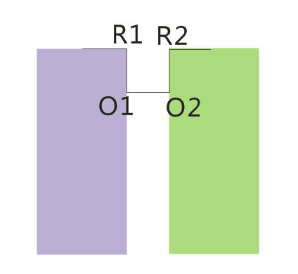

The 2008 ACM Programming Contest World Finals

<table>
<thead>
<th width='40px' align='center'>Id</th>
<th width='500px' align='left'>Problem</th>
<th width='130px' align='left'>Link</th>
<th width='80px' align='left'>Code</th>
</thead>
<tbody>
<tr><td>A</td>   <td>Air Conditioning Machinery</td>   <td>LA 4118</td>   <td><a href='la4118.cpp'>C++</a></td>   </tr>
<tr><td>B</td>   <td>Always an integer</td>   <td></td>   <td></td>   </tr>
<tr><td>C</td>   <td>Conveyor Belt</td>   <td></td>   <td></td>   </tr>
<tr><td>D</td>   <td>The Hare and the Hounds</td>   <td></td>   <td></td>   </tr>
<tr><td>E</td>   <td>Huffman Codes</td>   <td></td>   <td></td>   </tr>
<tr><td>F</td>   <td>Glenbow Museum</td>   <td>LA 4123</td>   <td><a href='la4123.cpp'>C++</a></td>   </tr>
<tr><td>G</td>   <td>Net Loss</td>   <td></td>   <td></td>   </tr>
<tr><td>H</td>   <td>Painter</td>   <td>LA 4125</td>   <td><a href='la4125.cpp'>C++</a></td>   </tr>
<tr><td>I</td>   <td>Password Suspects</td>   <td></td>   <td></td>   </tr>
<tr><td>J</td>   <td>The Sky is the Limit</td>   <td>LA 4127</td>   <td><a href='la4127.cpp'>C++</a></td>   </tr>
<tr><td>K</td>   <td>Steam Roller</td>   <td>LA 4128</td>   <td><a href='la4128.cpp'>C++</a></td>   </tr>
</tbody>
</table>

## Problem A. Air Conditioning Machinery

##### Solution

可以使用限制深度的迭代加深方法进行DFS。使用四元组(x,y,z,dir)表示当前的状态即可。 

## Problem F. Glenbow Museum

##### Summary

##### Solution

一个合法的字符串有如下性质

* 由于多边形外角和是360度，每个R为外角和“贡献”90度，每个O为外角和贡献-90度。所以R肯定比O多四个。
* 不可能存在两个相邻的O。原因：如果有两个相邻的O，那么必定不能形成星形多边形。如图，有两个连续的O，看到R1点的区域位于R1O1的左边（紫色区域），看到R2点的区域位于R2OR的右边（绿色区域），两个区域没有重叠，因此不满足题目要求。 

那么问题就转化为：给出r个R，r-4个O，求这些R与O能够组成多少种字符串，使得没有两个O相邻。这时有如下两种情况：

1. 串长为奇数则答案为0。
2. 字符串以R结尾，那么如果有r个R，那么相当于找4个位置放多出来的四个R,其余放OR。方案数为C(r,4)。
3. 字符串以O结尾，那么如果有r个R，字符串的形式必定是xxxxxxRO（因为最后的那个O前面必定是R）。那么相当于找在r-1个位置中找4个放R，其余位置放RO。方案数为C(r-1,4)。 

最终答案就是C(r,4)+C(r-1,4)。 

## Problem H. Painter

##### Summary
给定平面上的N个三角形(N<=100000)，判断是否有任意两个相交，如果没有，给出嵌套的最大层数。 
##### Solution

如果不相交，那么可以使用扫描线算法解决。

扫描线x=K从左向右扫描平面上所有的三角形，假设三角形三个点按照从左向右为p1,p2,p3，会发生如下事件点：

1. 插入事件，插入一个新的三角形的两条边(p1,p2)，(p1,p3)。
2. 变更事件，删除三角形的一条边(p1,p2)，插入(p2,p3)
3. 删除事件，退出整个三角形(p1,p3),(p2,p3)。 

括号表示法：如图，用括号序列表示扫描线事件点发生后，三角形的边的在y方向的嵌套关系。图中红色表示插入事件，黄色表示变更事件，蓝色表示删除事件。

'''
1 ()
2 (()) 
3 (()())
4 (()())
5 ((())())
6 ((())())
7 (()())
8 (()())
9 (())
A ()
B (())
C (())
D ()
E 
'''

这个括号序列，也就是许多线段，可以使用平衡二叉树来维护，线段之间的大小关系就是该线段在当前扫描线时的y坐标。虽然每个括号在不同扫描线x=K的时候，y坐标都不一样，但是如果不发生线段相交的话，其位置关系是不变的。

根据扫描线算法的定义，有如下规律： 

* 线段的相交只会发生在平衡树上“相邻”的两个节点中。因此只需要在插入后检查当前插入线段是否去相邻两个节点相交，删除前判断删除的线段的前后两个将要变成相邻节点的两个线段是否相交，即可判断出是否有三角形相交。
* 嵌套层数，使用depth表示，为平衡树的字段： 

'''
if x 为左括号 then x=pre(x).depth＋1

else if x 为右括号 then x=pre(x).depth-1

(pre为前一个节点)

'''
实现细节

* 实现时为了不把来自同一个三角形的线段误作相交，需要在线段中记录来自哪个三角形。
* 扫描线的事件点，实际上是发生在点坐标x的偏右一点点的位置，才会产生两条线段。因此每次检查x时，先对x加上一个很小的数值eps，再计算出扫描线割该线段时对应的y坐标。
* 如果线段垂直与X轴，那么直接计算y坐标会出错。这时可以把线段中点的y坐标作为扫描线割该线段对应的y值。
* 平衡树可以使用multimap来实现，如果迭代器为it，那么it的前一个点就是it--，后一个点就是it++。 

##### Credit
Zhang Kunwei

## Problem J. The Sky is the Limit

##### Solution
由于n的范围比较小，n<=100，因此可以想到如下比较容易想到的方法：

首先把根据每个山峰的起点，中点，终点，以及各个山峰之间的交点，所有的这些点的x坐标，数轴划分成很多个区间。那么，易得数轴上每个区间，山的轮廓线不会交叉。那么我们只要找出区间上面最“高”的那条线段就是所求。求出这些最高的线段后，将其长度累计即可。

## Problem K. Steam Roller

##### Solution

使用最短路算法解决该问题。

由于刹车前后的道路，以及启动后、终止前的道路的耗费的时间都要加倍，因此需要有恰当的状态表示方法，以免某些道路的加倍被重复计算。最短 路使用状态：dis[issame][direction][pt]表示，意思是当前点为Pt，进入pt的方向为dir，前两条步的方向是否相同为 issame的情况下，到达pt前一点pp的最短路。之所以这样表示状态，是因为pp是否按双倍计算是不知道的。选择当前点的前进方向，会影响之前的时间 （如果转弯，上一段路的时间就要加倍）。如果不加以记录，有可能会重复计算。对于当前的状态，如果issame为false，或当前dir与下一个dir 不一致，都要将pp到pt这一段路的距离双倍计算。

注意起始点与终点的处理。尤其是到达终点，必须进行统计最优值，而不能马上退出。而且到达终点后有可能继续走，再返回终点，会得到更优的答案，要稍加注意。

